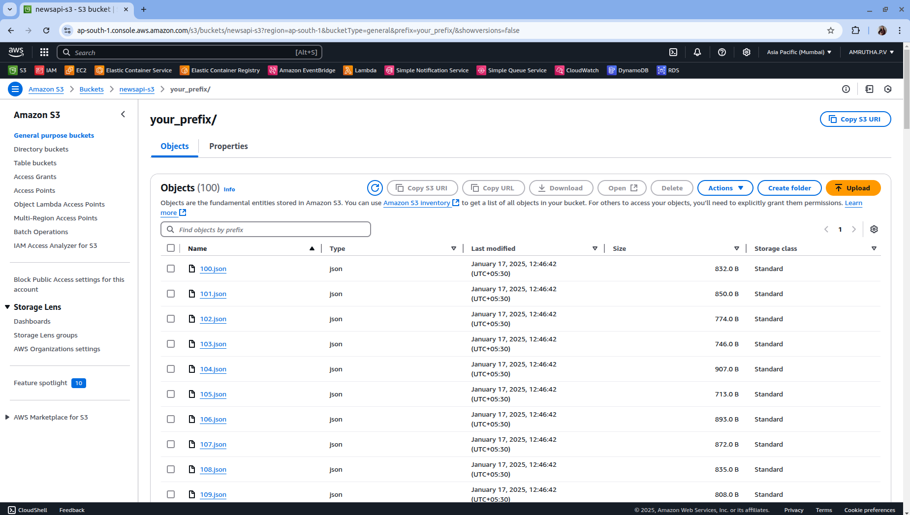

End-to-End Sentiment Analysis Pipeline

This project implements a data pipeline designed to efficiently fetch, process, and analyze the sentiment of news articles using Kafka and AWS services.

#Architecture

> The pipeline starts by **fetching news articles** using a NewsAPI key obtained from the NewsAPI website after creating an account. These articles serve as the starting point of the pipeline.

> The **news articles are processed with AWS Lambda**, a serverless service that automatically scales to handle raw news data efficiently.

> The **processed data is sent to Apache Kafka** hosted on EC2, ensuring smooth data streaming with high availability. The Kafka producer sends the data, while the consumer receives and processes it.For this process, it’s essential to start the **Kafka server**, **Zookeeper**, and create a topic.

> The **processed consumer data is pushed to an S3 bucket** and stored in JSON format for durability and scalability.

#S3 Output

> **Spark Streaming** is used to process the consumer data further, which is then stored in **Amazon RDS (PostgreSQL)** for real-time querying. To enable systematic storage, a table must be created in the database. The stored data can be accessed locally or using **PGAdmin**.

#RDS Output

> **Sentiment analysis** is performed on the news articles, categorizing them as **positive, negative, or neutral**. A **dashboard is created using Streamlit** on a local system to visualize the sentiment analysis results.

#Local Streamlit

> The pipeline uses **Docker** to store images containing sentiment analysis models and required tools (e.g., `pandas`, `sqlalchemy`, `psycopg2-binary`, `textblob`, `streamlit`) for easy deployment.

> The Docker containers are managed on **AWS ECS Fargate**, a serverless container management service. To run the pipeline, a **Fargate cluster**, **task definition**, and **services** are created.

> The sentiment analysis results are displayed on an **interactive dashboard** accessible via a public IP address, providing users with valuable insights into news sentiment trends.

#Streamlit Dashboard

